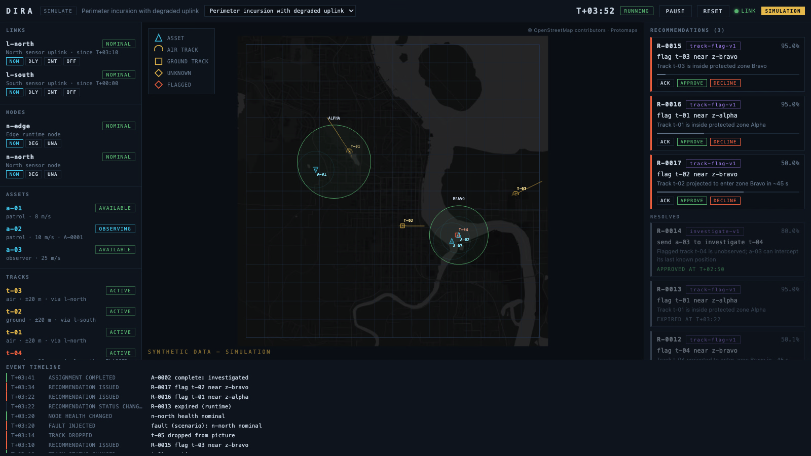

# dira

[](https://github.com/Dnakitare/dira/actions/workflows/ci.yml)
[](LICENSE)

A compiled, edge-hosted digital-twin and operator-coordination runtime. One Rust binary maintains an authoritative local operating picture, evaluates configurable coordination policies, and records an auditable event log. A React + Three.js console visualizes and controls it from a browser. The browser is never the authority: if it disconnects, the runtime keeps going, and the picture resynchronizes on reconnect.

Everything in this repository is simulation. Inputs are synthetic, entities are generic (track, asset, zone, assignment), and every action is a recommendation until an operator approves it.

**[Live demo](https://dnakitare.github.io/dira/)** — the actual console replaying a recorded run in your browser, no install. (It's a static export: the same UI you get against a live runtime, minus the ability to task anything.)



## What it demonstrates

- **Deterministic simulation.** Fixed 100 ms timestep, one seeded ChaCha8 stream, ordered iteration. The same scenario file and seed produce the same event stream, tick for tick. Tests enforce this.
- **Authoritative edge state.** The runtime owns the world. Clients get snapshots and events over a versioned WebSocket protocol and send bounded, validated commands that fail closed.
- **Degraded-link honesty.** Links can be delayed, intermittent, or unavailable, per scenario timeline or operator injection. Track uncertainty grows with observation age and the console renders it, so a degraded picture looks degraded.
- **Operator-in-the-loop.** Policies produce recommendations with a reason, policy id, and confidence. Nothing is tasked without an explicit approval, which is itself an audit event.
- **Auditable replay.** Runs are recorded to SQLite (events plus periodic snapshots). Replay mode streams the record back at selectable speed. What you replay is exactly what happened, including operator actions.
- **Benchmarkable policies.** Headless mode runs a scenario across seeds with a scripted operator and prints aggregate metrics, so two policy configurations can be compared on numbers.

## Quick start

**From a release** (no toolchain needed): download the archive for your platform from [Releases](https://github.com/Dnakitare/dira/releases), unpack, then:

```sh
./dira simulate --scenario scenarios/perimeter-incursion.toml
# open http://127.0.0.1:8080
```

**From source** (Rust 1.75+, Node 20+ with pnpm):

```sh
# build the console once
cd web && pnpm install && pnpm build && cd ..

# run a scenario and open http://127.0.0.1:8080
cargo run -p dira-runtime -- simulate --scenario scenarios/perimeter-incursion.toml

# replay a recorded run
cargo run -p dira-runtime -- replay --db dira.db --run 1 --speed 4

# compare policy configurations headless
cargo run -p dira-runtime -- benchmark --scenario scenarios/perimeter-incursion.toml --runs 10
cargo run -p dira-runtime -- benchmark --scenario scenarios/perimeter-incursion.toml --runs 10 \
  --policy scenarios/policy-conservative.toml
```

`dira edge --config edge.toml` runs the same runtime as a long-lived service on a Linux edge device. Non-loopback binds refuse to start without an auth token.

## Layout

```
crates/domain     world state, policy evaluation, metrics (no I/O, no clocks)
crates/protocol   versioned WebSocket messages
crates/simulator  scenario files, deterministic engine
crates/runtime    the dira binary: simulate | edge | replay | benchmark
web/              React + Three.js operator console
scenarios/        scenario and policy configuration files
docs/             architecture, protocol, test plan, demo script
```

Details in [docs/architecture.md](docs/architecture.md). Wire format in [docs/protocol.md](docs/protocol.md). Design decisions and their rejected alternatives in [docs/adr/](docs/adr/).

## Tests

```sh
cargo test --workspace
```

The tests are the point of the project: identical runs from identical inputs (also property-tested over generated scenarios), different seeds diverge, disabled policies stay silent, commands fail closed, and a run with no operator approvals tasks nothing — ever, for any generated input.

## Performance

10,000 tracks tick in 6.25 ms p50 against a 100 ms budget on an Apple M2, with all policies enabled. Numbers, method, and the O(n²) the stress benchmark caught are in [docs/performance.md](docs/performance.md). Reproduce with `cargo run --release -p dira-runtime -- benchmark --stress 10000`.

## Status and boundaries

Early, simulation-first proof of engineering capability in edge-hosted software, resilient local operation, digital twin and replay, and auditable decision support. It has not been used operationally and makes no autonomy claims. Input adapters beyond simulation and replay are deliberately out of scope; the core consumes typed observations through a narrow seam so real sources can be added without touching domain logic.

MIT license.
